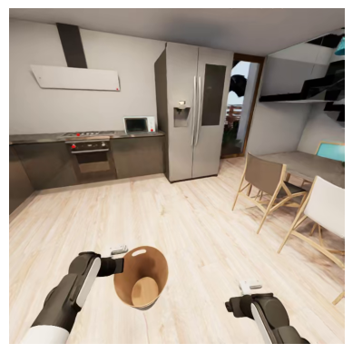
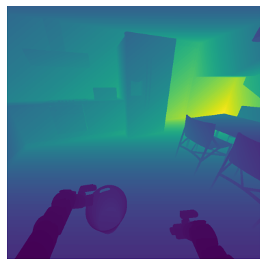
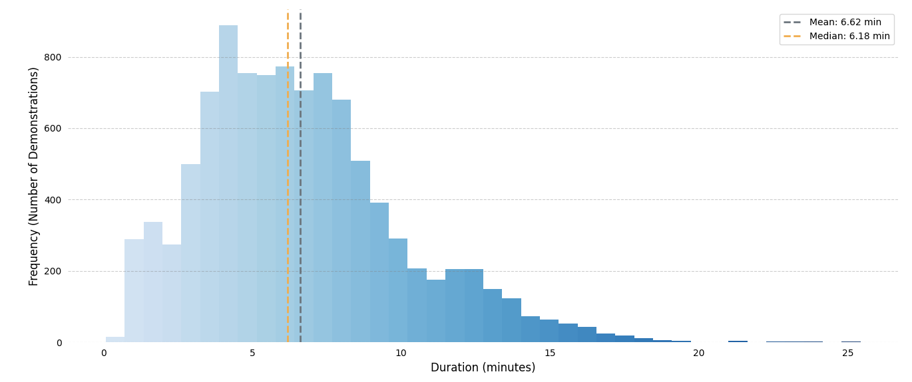
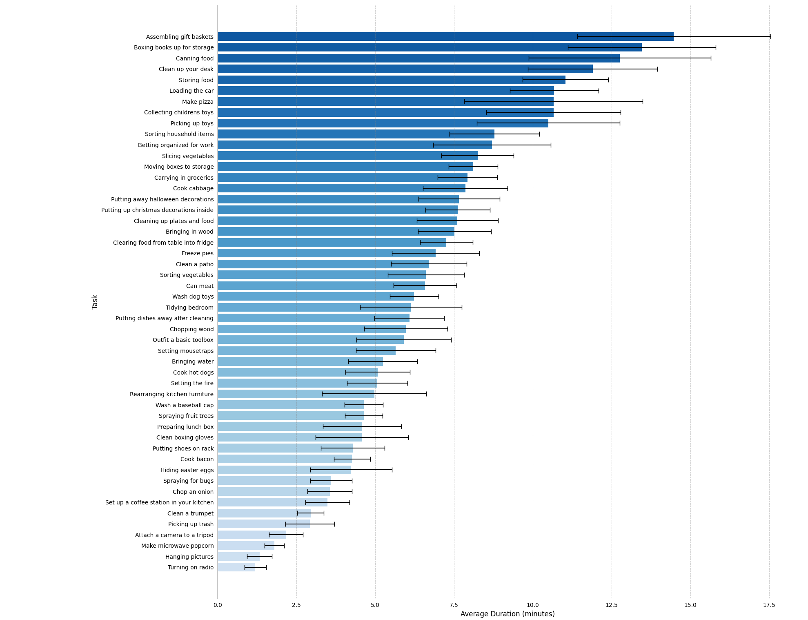

# Dataset

## Data Format

For the 2026 challenge, we provide the following datasets hosted on HuggingFace:

1. [2026-challenge-rawdata](https://huggingface.co/datasets/behavior-1k/2026-challenge-rawdata): the original raw HDF5 data of the 20k teleoperation demos. These files contains everything needed to replay the exact trajectory in OmniGibson. We use this alongside with `OmniGibson/scripts/learning/replay_obs.py` to replay the trajectory and collect additional visual observations.

2. [2026-challenge-demos](https://huggingface.co/datasets/behavior-1k/2026-challenge-demos): 20000 human-collected teleoperation demos across 100 tasks. It follows the [LeRobot](https://huggingface.co/lerobot) V3 format with some customizations for better data handling. The dataset has the following structure:

    | Folder       | Description                                                                  |
    |--------------|------------------------------------------------------------------------------|
    | annotations  | language annotations for each episode                                        |
    | data         | low dim data, including proprioceptions, actions, camera poses, etc.         |
    | meta         | metadata folder containing episode-level information                         |
    | videos       | visual observations, including rgb and depth                                 |

To learn more about the LeRobot format, visit the official [LeRobot repository](https://github.com/huggingface/lerobot). The whole dataset is ~1.5T, and <u>we provide APIs to perform partial downloads based on task name, cameras, and modalities</u>. We also provide functions to generate new modalities based on what's given by the dataset. Please refer to our tutorial notebooks about [loading the dataset](https://github.com/StanfordVL/b1k-baselines/blob/main/tutorials/dataset.ipynb) and [generating custom data](https://github.com/StanfordVL/b1k-baselines/blob/main/tutorials/generate_custom_data.ipynb).

The dataset includes 2 visual modalities: RGB (rgb) and Depth (depth_linear):

<table markdown="span">
    <tr>
        <td valign="top" width="60%">
            <strong>RGB</strong>    
            RGB image of the scene from the camera perspective.   
            Size: (height, width, 4), numpy.uint8  
            Resolution: 720 x 720 for head camera, 480 x 480 for wrist cameras. Range: [0, 255]   
            We provide [RGBVideoLoader](https://github.com/StanfordVL/BEHAVIOR-1K/blob/main/OmniGibson/omnigibson/learning/utils/obs_utils.py#L315-L330) class for loading RGB mp4 video from demo dataset.   
        </td>
        <td>
            
        </td>
    </tr>
    <tr>
        <td valign="top" width="60%">
            <strong>Depth Linear</strong>    
            Distance between the camera and everything else in the scene, where distance measurement is linearly proportional to the actual distance.  
            Size: (height, width), numpy.float32  
            During data replay, we converted raw depth data to mp4 videos through a log quantization step. Our provided data loader will dequantize the video, and return (unnormalized) depth value within the range of [0, 10] meters.  
            Please checkout [quantize_depth](https://github.com/StanfordVL/BEHAVIOR-1K/blob/main/OmniGibson/omnigibson/learning/utils/obs_utils.py#L41-L63) and [dequantize_depth](https://github.com/StanfordVL/BEHAVIOR-1K/blob/main/OmniGibson/omnigibson/learning/utils/obs_utils.py#L66-L88) for more details.   
            We provide [DepthVideoLoader](https://github.com/StanfordVL/BEHAVIOR-1K/blob/main/OmniGibson/omnigibson/learning/utils/obs_utils.py#L333-L351) class for loading depth mp4 video from demo dataset.   
        </td>
        <td>
            
        </td>
    </tr>
</table>

## Dataset Statistics

| Metric | Value |
| ------ | ----- |
| Total Trajectories | 20,000 |
| Total Tasks | 100 |
| Total Skills | 270,600 |
| Unique Skills | 31 |
| Avg. Skills per Trajectory | 27.06 |
| Avg. Trajectory Duration | 397.04 seconds / 6.6 minutes |

<b>Show unique skills breakdown</b>

<ul>
<li>attach</li>
<li>chop</li>
<li>close door</li>
<li>close drawer</li>
<li>close lid</li>
<li>hand over</li>
<li>hang</li>
<li>hold</li>
<li>ignite</li>
<li>insert</li>
<li>move to</li>
<li>open door</li>
<li>open drawer</li>
<li>open lid</li>
<li>pick up from</li>
<li>place in</li>
<li>place in next to</li>
<li>place on</li>
<li>place on next to</li>
<li>place under</li>
<li>pour</li>
<li>press</li>
<li>push to</li>
<li>release</li>
<li>spray</li>
<li>sweep surface</li>
<li>tip over</li>
<li>turn off switch</li>
<li>turn on switch</li>
<li>turn to</li>
<li>wipe hard</li>
</ul>

### Overall Demo Duration

### Per Task Demo Duration

