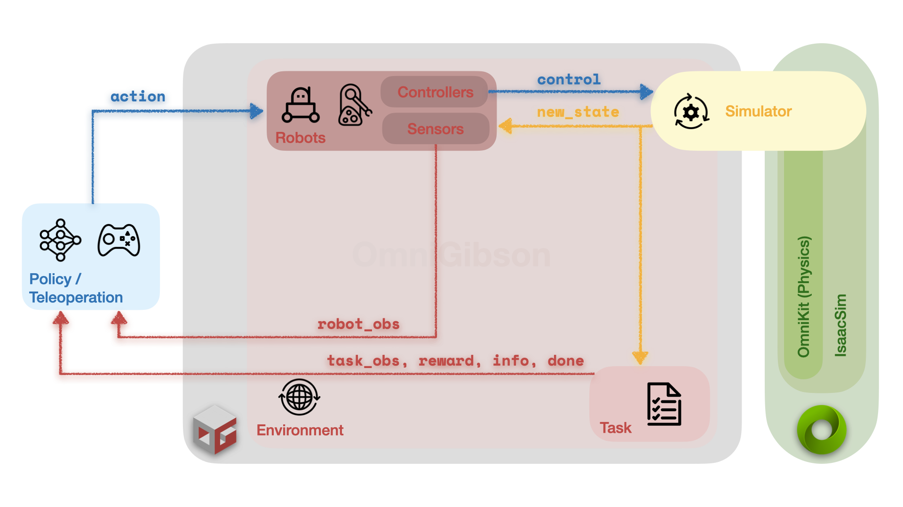

# **Overview**

<figure markdown="span">
  { width="100%" }
</figure>

**`OmniGibson`**'s framework provides **modular APIs** for (a) quickly interacting with different components of a created environment and (b) prototyping and developing custom environments.

**`OmniGibson`** is built upon NVIDIA's [IsaacSim](https://docs.omniverse.nvidia.com/isaacsim/latest/index.html), a powerful simulation platform that uses [PhysX](https://nvidia-omniverse.github.io/PhysX/physx/5.3.1/index.html) as the physics backend.

We build upon IsaacSim's `Simulator` interface to construct our `Environment` class, which is an [OpenAI gym-compatible](https://gymnasium.farama.org/content/gym_compatibility/) interface and the main entry point into **`OmniGibson`**. An `Environment` instance generally consists of the following:

- A [`Scene`](./scenes.md) instance, which by default is a "dummy" (empty) or a full-populated (`InteractiveTraversableScene`) instance,
- A [`BaseTask`](./tasks.md) instance, which can range from a complex `BehaviorTask`, navigation `PointNavigationTask`, or no-op `DummyTask`,
- Optionally, one or more [`BaseRobot`](./robots.md)s, which define the action space for the given environment instance,
- Optionally, one or more additional [`BaseObject`](./objects.md)s, which are additional object models not explicitly defined in the environment's scene

The above figure describes **`OmniGibson`**'s simulation loop:

1. **Action Execution:** An externally defined `action` is passed to `Robot` instances in the `Environment`, which is processed by each robot's own set of `Controller`s and converted into low-level joint commands that are then deployed on the robot.
2. **Simulation Stepping:** The simulator takes at least one (and potentially multiple) physics steps, updating its internal state.
3. **Observation Retrieval:** Sensors on each `Robot` instance grab observations from the updated simulator state, and the loaded `Task` instance also computes its task-relevant observations and updates its internal state. The observations as well as task-relevant data is then returned from the `Environment` instance.

Each of the modules in **`OmniGibson`** can be extended by the user, and allow for custom subclass implementations to be used without needing to directly modify **`OmniGibson`** source code. This section provides high-level overviews of each of the modules, as well as general insight into the purpose and intended use-cases of each module.
