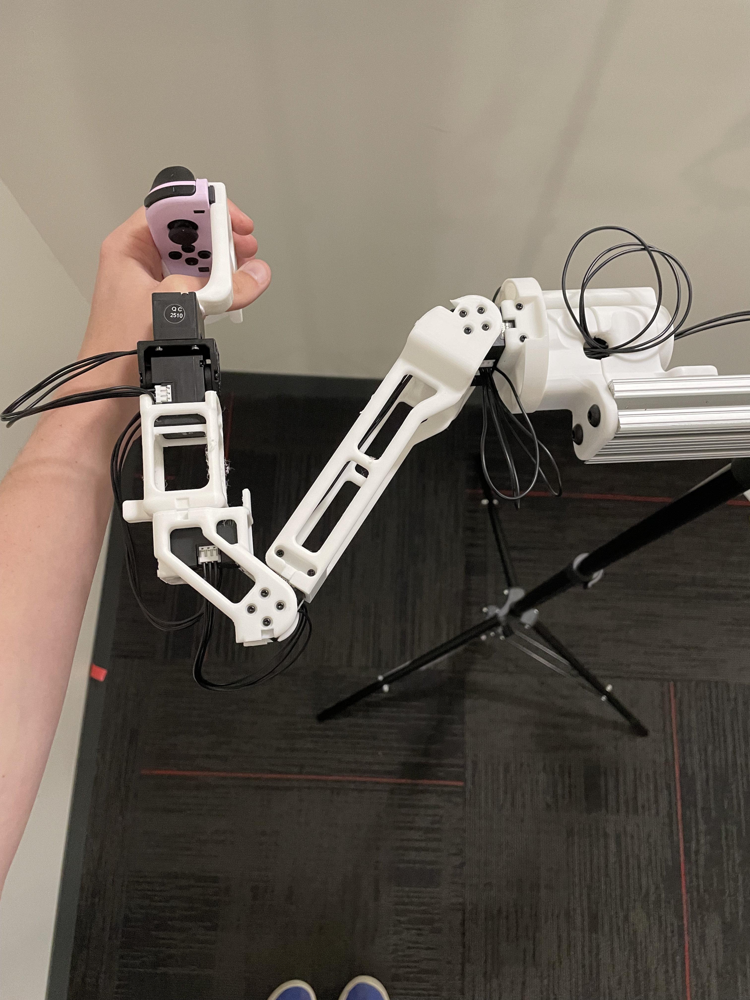
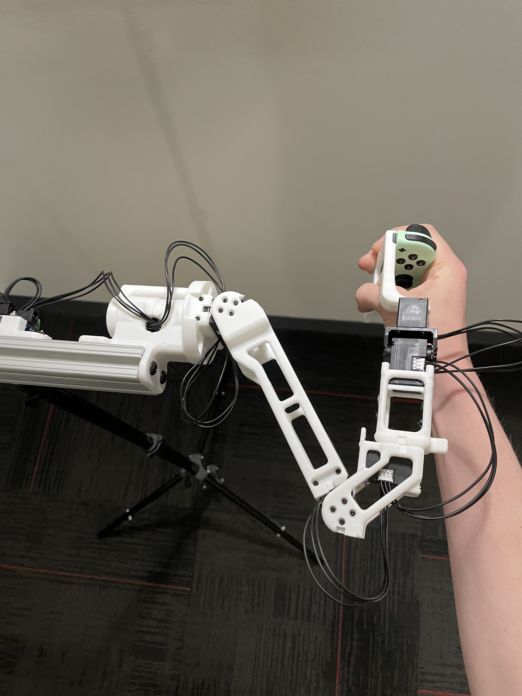
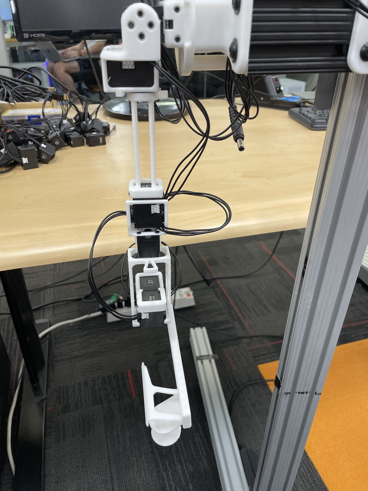
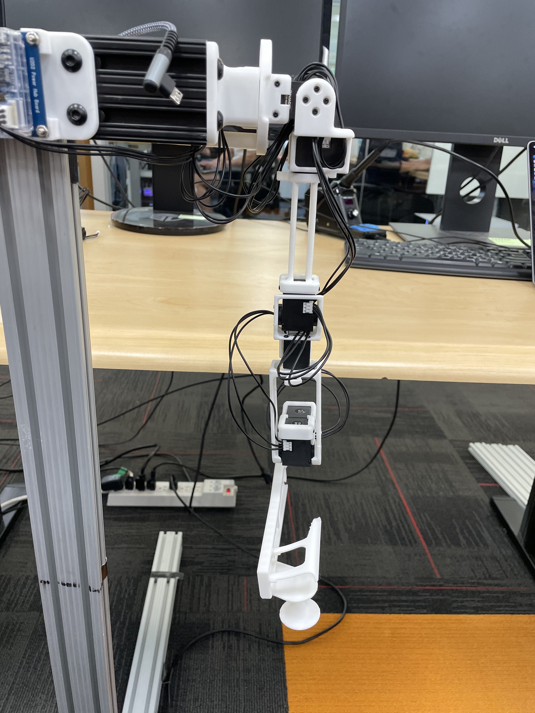
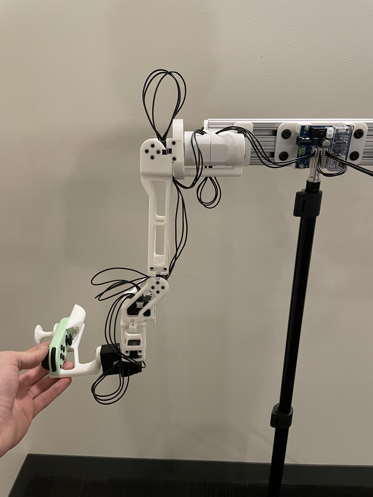
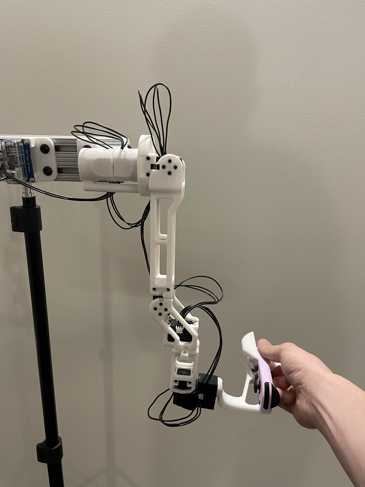
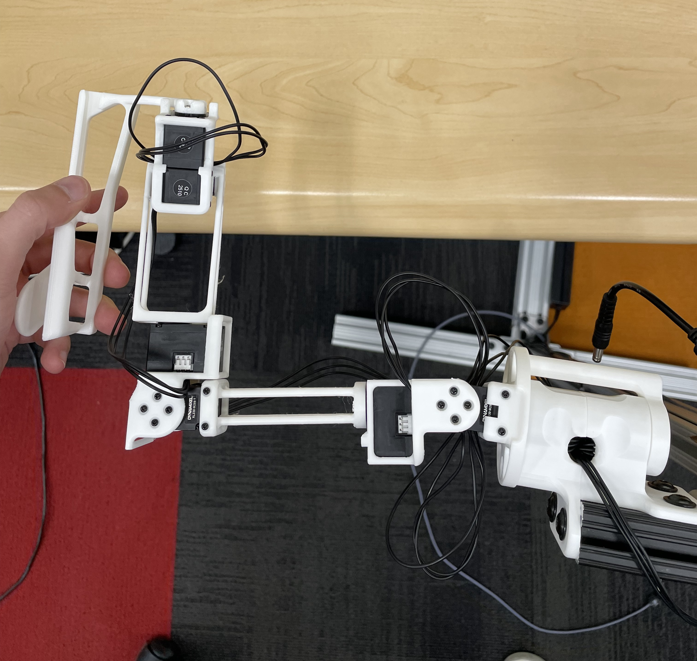
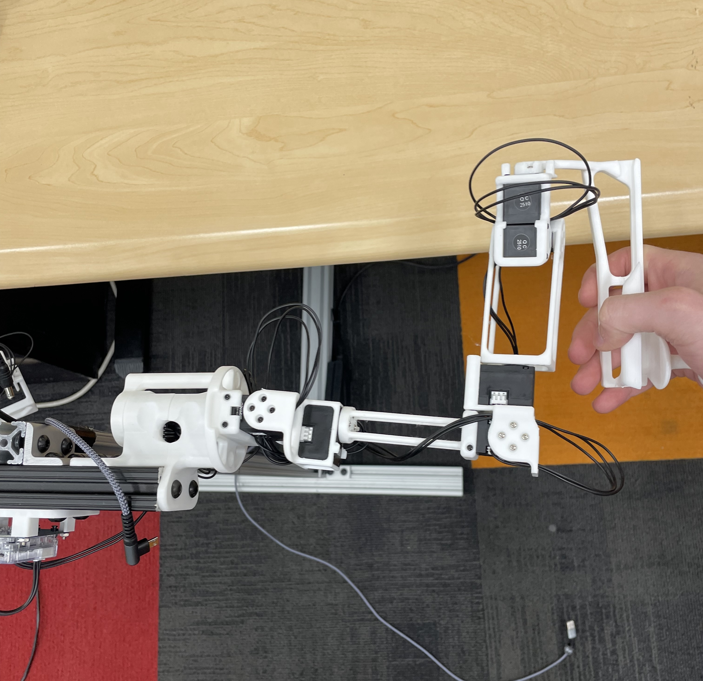

# Data Collection with JoyLo for OmniGibson

## Hardware Setup

### 1. JoyLo assembly 

- 7 DoF R1-Pro: https://github.com/user-attachments/assets/d6d3ee59-dfac-4ece-92f4-ea44619a2d05

- [Depricated] For the 6dof R1 version, please reference this [guide](https://behavior-robot-suite.github.io/docs/sections/joylo/overview.html) from the [BEHAVIOR Robot Suite](https://behavior-robot-suite.github.io/).

### 2. Nintendo JoyCon Configuration

1. Configure udev rules:
```bash
sudo nano /etc/udev/rules.d/50-nintendo-switch.rules
```

2. Add the following content to the file:
```
# Switch Joy-con (L) (Bluetooth only)
KERNEL=="hidraw*", SUBSYSTEM=="hidraw", KERNELS=="0005:057E:2006.*", MODE="0666"

# Switch Joy-con (R) (Bluetooth only)
KERNEL=="hidraw*", SUBSYSTEM=="hidraw", KERNELS=="0005:057E:2007.*", MODE="0666"

# Switch Pro controller (USB and Bluetooth)
KERNEL=="hidraw*", SUBSYSTEM=="hidraw", ATTRS{idVendor}=="057e", ATTRS{idProduct}=="2009", MODE="0666"
KERNEL=="hidraw*", SUBSYSTEM=="hidraw", KERNELS=="0005:057E:2009.*", MODE="0666"

# Switch Joy-con charging grip (USB only)
KERNEL=="hidraw*", SUBSYSTEM=="hidraw", ATTRS{idVendor}=="057e", ATTRS{idProduct}=="200e", MODE="0666"

KERNEL=="js0", SUBSYSTEM=="input", MODE="0666"
```

3. Refresh udev rules:
```bash
sudo udevadm control --reload-rules && sudo udevadm trigger
```

4. [Optional] Install Bluetooth manager:
```bash
sudo add-apt-repository universe
sudo apt-get install blueman
```

### 3. Connecting JoyCons

#### Method 1: Using system settings or Bluetooth Manager (Recommended)
1. Ensure your external Bluetooth dongle is connected
2. Open system bluetooth settings or Bluetooth Manager
3. Search for JoyCon devices and connect when they appear

#### Method 2: Using Command Line (If Method 1 fails)
1. Run the following commands:
```bash
bluetoothctl
scan on
# Wait for Joy-Con (L) and (R) to appear with their MAC addresses
# For each controller:
pair <MAC_ADDRESS>
trust <MAC_ADDRESS>
connect <MAC_ADDRESS>
```
2. Verify connection: JoyCon lights should be static (not flashing)


### 4. JoyLo Calibration

NOTE: Please install BEHAVIOR-1K (see Software Setup section 1) before running calibration scripts. 

- JoyLo sets can be assembled in slightly different ways, resulting in different orientations of the motors and offsets between the physical motor positions and the joint positions in simulation. 
- A script for automatically determining these joint signs and offsets is available in `scripts/calibrate_joints.py`.
- We will also need to calibrate the joysticks on the joycons, a script is available in `scripts/calibrate_joycons.py`
- You need to run the two scripts once before the first time you perform any data collection on the PC.


Run the following command and follow the instructions:

```
python scripts/calibrate_joycons.py 
```

This will create two `joycon_calibration_xxx.yaml` under `joylo/configs`

Run the following command to calibrate joints:

```
python scripts/calibrate_joints.py 
```
This will createa a `joint_config_default.yaml` under `joylo/configs`

#### Reference Positions
The calibration script requires each arm to be placed in two fixed reference positions, called the "zero" and "calibration" positions. These are provided below for both the R1 (6-DOF) and R1-Pro (7-DOF) JoyLo variants.

|                      | R1 (6-DOF) | R1-Pro (7-DOF) |
|----------------------|----------- |----------------| 
| Zero Position        |   |                 |
| Calibration Position |   **NOTE: Take from the front - note the forwards orientation of the notch on the wrist joint**|  |


## Software Setup

### 0. Prerequisites

- Ubuntu 22.04+
- NVIDIA RTX-enabled GPU
- External Bluetooth dongle (recommended: [[link](https://www.amazon.com/dp/B08DFBNG7F/ref=pe_386300_442618370_TE_dp_i1?th=1)])

### 1. BEHAVIOR-1K Installation

All software dependencies (OmniGibson, BDDL, JoyLo, datasets) are installed via
the `setup.sh` script in the BEHAVIOR-1K repository root. Run the following command to install all the essentials needed:

```bash
cd /path/to/BEHAVIOR-1K
./setup.sh --new-env --omnigibson --bddl --joylo --dataset --eval
```
This will create a new conda environment `behavior`. 

Then, run datasets setup again to make sure everything is up-to-date:

```bash
conda activate behavior
./setup.sh --dataset
```


### 2. Running the System

NOTE: Please make sure you have run calibration scripts (see Hardware Setup section 4) before running the following scripts

The system runs two scripts in separate terminals, the scripts are located under `joylo/scripts`:

| Script | Purpose | Key args |
|---|---|---|
| `launch_og.py` | Starts the OmniGibson simulation server | `--robot`, `--task_name`, `--recording_path` |
| `run_joylo.py` | Starts the JoyLo teleoperation client | `--gello_model`, `--joint_config_file` |

1. Ensure JoyLo is powered on (with motors NOT connected to Dynamixel software)
2. Ensure JoyCons are connected

3. In one terminal, start the recording environment with a specified task:
```bash
python experiments/launch_nodes.py --task_name turning_on_radio --recording_path /path/to/recording_file_name.hdf5
```

4. In another terminal, run the JoyLo node:
```bash
python experiments/run_joylo.py 
```

### Usage Notes

- Press the home button on the right JoyCon to save an episode and reset the scene
- To save all episodes and exit, focus your mouse on the OmniGibson window and press Escape
- Recording file will be saved to the path specified in the launch_nodes.py command
- Fast base motion mode: Activate by pressing down on the left joystick while moving it
- Object visibility toggle: Press A button on the right JoyCon to toggle between hiding non-relevant objects and showing all objects
- JoyCon connection stability: We have noticed that sometimes the JoyCon could disconnect randomly during data collection. A team member has reported that putting the Bluetooth dongle onto USB 2.0 is more stable than USB 3.0. We will look further into this issue.
- Available tasks are listed in `datasets/2025-challenge-task-instances/metadata/available_tasks.yaml`

## Troubleshooting

### JoyCon connection issues
- If JoyCons won't connect, try the command line method (Method 2 above)
- Ensure you're using an external Bluetooth dongle, as built-in Bluetooth may not be compatible
- Verify that udev rules are properly configured if devices aren't recognized
- If JoyCons disconnect randomly during data collection, try connecting the Bluetooth dongle to a USB 2.0 port instead of USB 3.0
- If the JoyCon is being used as a mouse, double check [this setting](https://askubuntu.com/a/891624) (or alternatively remove `50-joystick.conf` directly)
- If the JoyCons are connected to Ubuntu in bluetooth but are still unable to be detected from Python, try `pip uninstall hidapi`, and then `pip install hid pyglm`, and then try again

### HID issues
- If you see something like `ImportError: Unable to load any of the following libraries:libhidapi-hidraw.so libhidapi-hidraw.so.0 libhidapi-libusb.so libhidapi-libusb.so.0 libhidapi-iohidmanager.so libhidapi-iohidmanager.so.0 libhidapi.dylib hidapi.dll libhidapi-0.dll`, try `sudo apt install libhidapi-hidraw0`.

## Joycon Button Mapping


