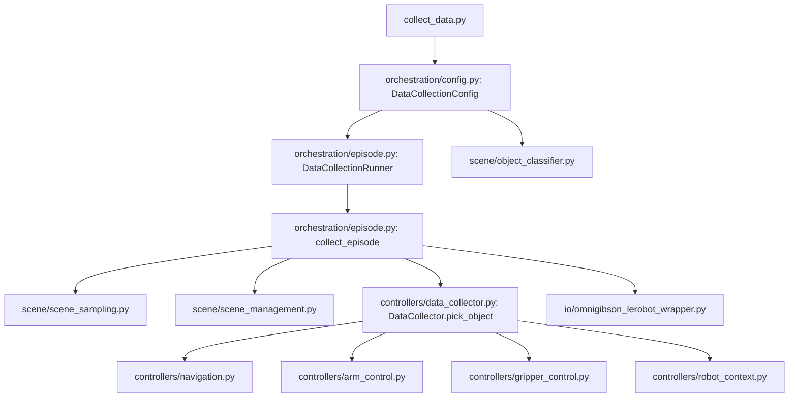

# Data Collection Architecture

This package records pick-only demonstrations in OmniGibson and writes them in LeRobot format.

The runtime starts in `vid2room_policy/collect_data.py`, builds a `DataCollectionConfig`, then hands off to orchestration modules.

## Runtime Flow

## Module Responsibilities

- `orchestration/episode.py`
  - environment setup/reset
  - episode attempt loop and retry logic
  - frame-level recording and metadata save
- `scene/scene_sampling.py`
  - support discovery and filtering
  - room mapping and start-pose sampling near supports
  - choosing a graspable object on the selected support
- `scene/scene_management.py`
  - optional object spawning when supports are empty
  - safe object cleanup (including releasing grasp)
- `controllers/data_collector.py`
  - pick pipeline orchestration
  - coordination between arm, gripper, and navigation controllers
- `io/omnigibson_lerobot_wrapper.py`
  - OG observation/action conversion
  - LeRobot feature schema and dataset writes

## Where To Edit

- Change task selection/sampling policy: `scene/scene_sampling.py`
- Change pick behavior: `controllers/data_collector.py` and `controllers/arm_control.py`
- Change retry / failure policy: `orchestration/episode.py`
- Change saved modalities/features: `io/omnigibson_lerobot_wrapper.py`
- Change category filtering: `orchestration/config.py` and `scene/object_classifier.py`

## Notes For Maintainers

- Current data collection mode is pick-only from a frozen base start pose sampled near the source support.
- Retry semantics are controlled via sentinels in `orchestration/episode.py`:
  - `__SCENE_UNSUITABLE__`
  - `__RETRY_ATTEMPT__`
- The wrapper expects one metadata dict per saved episode.
